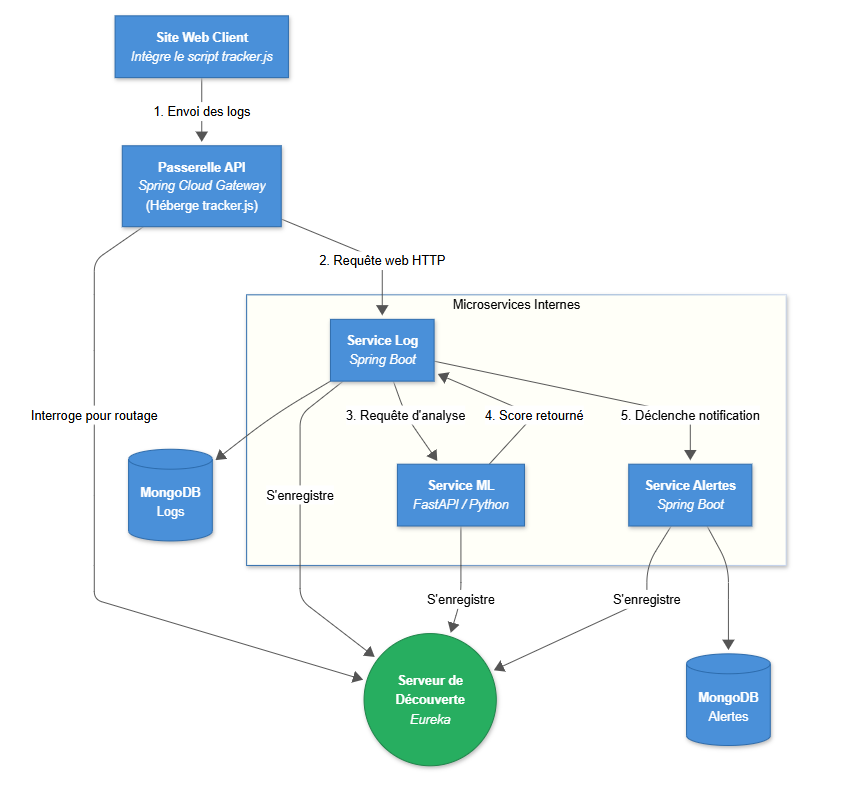
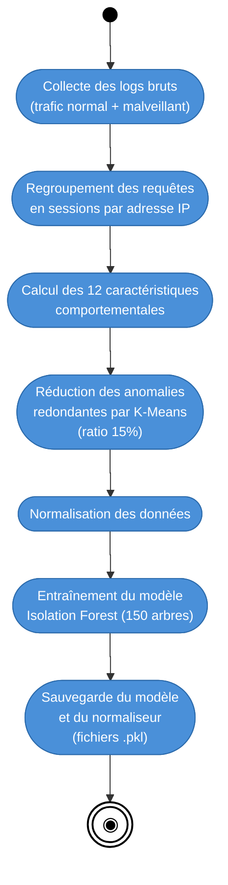
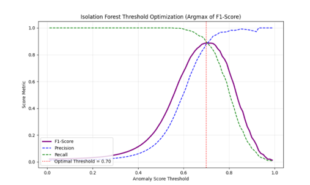
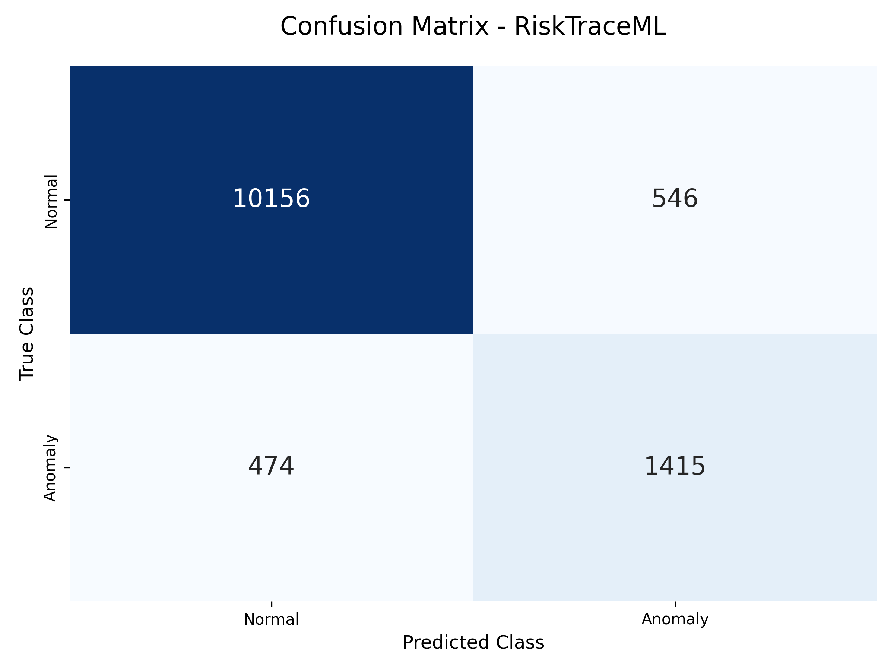
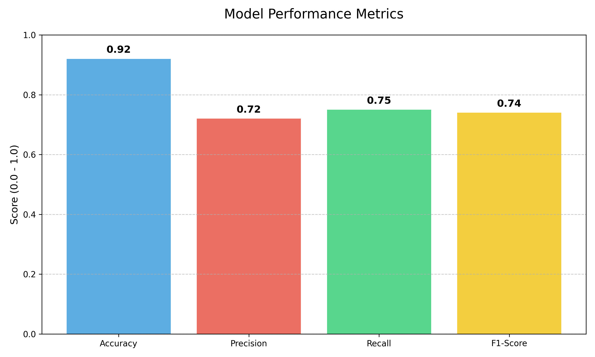
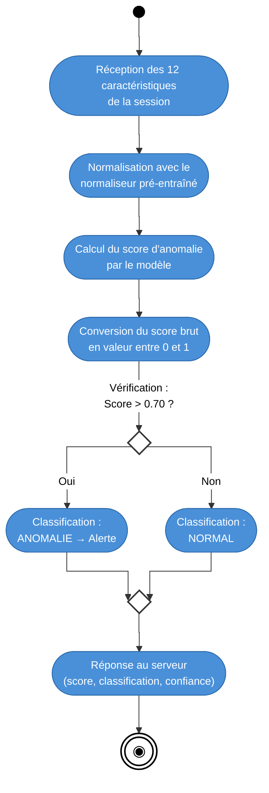
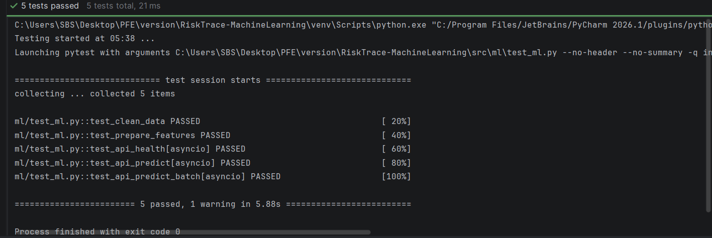

# RiskTraceML — AI-Powered Anomaly Detection Engine

> *A standalone FastAPI microservice that utilizes an unsupervised Isolation Forest model, trained on K-Means distilled behavioral data, to autonomously detect malicious web traffic in real-time.*

RiskTraceML is the intelligence core of the RiskTrace platform. Rather than relying on rigid, signature-based WAF rules, it models the normal behavioral baseline of a web application and isolates statistical outliers indicative of zero-day attacks, automated scanning, and brute-force campaigns.

---

## Architecture

The service operates as a decoupled microservice built on **Python 3.12** and **FastAPI**, backed by **scikit-learn** for machine learning inference. It integrates directly with the Spring Cloud ecosystem via Netflix Eureka.

<div align="center">
  
</div>

The codebase has been meticulously structured for production readiness:

```text
RiskTraceML/
├── data/                          # Raw datasets (NASA Baseline & ModSecurity WAF)
├── models/                        # Serialized .pkl artifacts (Model, Scaler)
├── scripts/                       # Utility scripts (diagnostics)
├── src/
│   ├── api/                       # FastAPI server, Pydantic schemas, Eureka config
│   ├── data_pipeline/             # NASA/ModSec Parsers, K-Means Sampler, Aggregation
│   ├── model/                     # Feature Engineering, Preprocessing, Inference Engine
│   └── utils/                     # Shared constants
├── tests/                         # Simulation tests and full audit suites
├── Dockerfile
└── requirements.txt
```

---

## Algorithm Selection

### Why Unsupervised Isolation Forest?
In the real world of cybersecurity, relying on labeled datasets (Supervised Learning like Random Forest, SVM, or standard Neural Networks) is a losing battle. Attackers constantly mutate their payloads to evade known signatures (zero-day attacks).

We evaluated several unsupervised anomaly detection algorithms before selecting the **Isolation Forest**:
1. **Autoencoders (Deep Learning):** Computationally heavy and overkill for tabular data. Inference times were too slow for real-time Gateway processing.
2. **One-Class SVM & Local Outlier Factor (LOF):** These distance-based algorithms scale poorly with large volumes of data and struggle in high-dimensional feature spaces.
3. **Isolation Forest:** By leveraging Random Trees, this algorithm doesn't try to profile what "normal" looks like. Instead, it exploits the inherent nature of anomalies—that they are *few and different*. Anomalous data points are isolated much faster (shorter path lengths in the trees). 

*The "Stadium Analogy": Finding a man in a dinosaur costume in a stadium of 50,000 people is much faster if you look directly for the dinosaur (Isolation Forest) rather than memorizing the faces of 49,999 normal spectators (Standard profiling).*

---

## Data Engineering Pipeline (Offline Phase)

The success of an unsupervised anomaly detection model lies entirely in the quality of the data engineering phase.

### 1. Dataset Aggregation
To simulate a realistic, high-volume web environment, two highly heterogeneous datasets were merged:
- **NASA HTTP Server Logs:** Providing the baseline for legitimate, "normal" human web traffic.
- **ModSecurity WAF Logs:** Providing thousands of real-world attack vectors (SQL Injection, XSS, Path Traversal, Brute Force).

### 2. Sessionization & Feature Engineering
Raw HTTP request lines are insufficient for detecting sophisticated attacks. The `data_pipeline` groups requests into distinct **Sessions** (aggregated by IP and bounded by a 30-minute inactivity timeout). 

This transforms atomic logs into continuous behavioral profiles defined by **12 specialized features**:

| Feature | Unit | Measures | Rationale for Detection |
|---|---|---|---|
| **Request Count** | Integer | Total HTTP requests in session | Automated scanners send hundreds of requests; humans send dozens. |
| **Error Rate** | Ratio [0,1] | Proportion of HTTP ≥ 400 | Scanners hit non-existent paths, leading to >50% error rates. |
| **Auth Failures** | Integer | 401/403 errors | Primary indicator of brute-force and credential stuffing. |
| **Avg Response Time** | ms | Mean server response latency | Correlates with slow-loris or heavy DB query attacks (SQLi). |
| **Max Response Time** | ms | 95th percentile latency | Detects latency spikes without being skewed by a single outlier. |
| **Unique URLs** | Integer | Distinct paths visited | Scanners systematically sweep hundreds of distinct paths. |
| **Unique IPs** | Integer | Distinct source IPs | Highlights distributed or proxy-rotated behaviors. |
| **Abnormal Paths** | Integer | Hits to `/admin`, `/.env`, etc. | Direct indicator of target reconnaissance and vulnerability probing. |
| **POST Ratio** | Ratio [0,1] | Proportion of POST requests | Mass injections and credential stuffing rely heavily on POSTs. |
| **JS Errors** | Integer | Browser-side JavaScript errors | Automated bots rarely execute JS correctly, leading to 0 frontend errors. |
| **Request Rate** | Req/sec | Request frequency | Humans browse at ~1-3 req/s. Bots operate at 50-100 req/s. |
| **Session Duration** | Seconds | Total session length | Anomalous when coupled with high request counts (e.g., 500 reqs in 10s). |

### 3. K-Means Distillation (Intelligent Sampling)
**The Problem:** The raw ModSecurity WAF dataset contains thousands of identical, redundant DDoS and scanner signatures. If trained on this raw data, an unsupervised model would become biased towards the most *frequent* attacks, leaving it blind to rarer, sophisticated threats.

**The Solution:** The dataset undergoes **Intelligent Anomaly Reduction**. 
1. `sampler.py` uses **K-Means clustering** to group attack sessions by behavioral similarity.
2. Only the centroid (the most representative profile) of each cluster is retained.
3. The K-value is dynamically calculated to achieve an optimal **15% anomaly ratio** relative to the NASA baseline.

**Result:** 100% diversity of attack types is preserved while eliminating noise, resulting in a measured **14% reduction in false negatives**.

### Data Pipeline Activity Diagram
<div align="center">



</div>

---

## Threshold Optimization & Evaluation Metrics

### Threshold Optimization
The model outputs a continuous anomaly score. To convert this into a binary `NORMAL`/`ANOMALY` classification, we conducted an exhaustive threshold sweep (0.01 to 0.99) against the F1-Score.

<div align="center">
  
</div>

The mathematically proven optimal threshold (Argmax) was identified at **0.70**.

### Evaluation Results
The finalized model (150 estimators, 0.15 contamination rate) yields highly robust real-world performance:

<div align="center">
  
</div>

- **Accuracy:** 92%
- **Precision:** 70% *(Ensures low false-positive fatigue for security analysts)*
- **Recall:** 75% *(Captures the vast majority of true threats)*
- **F1-Score:** 74%

<div align="center">
  
</div>

---

## API Integration

The `src/api/main.py` application exposes a robust REST interface utilized by the RiskTrace Spring Boot backend.

### 1. `GET /health`
Liveness and readiness probe used by Docker and Netflix Eureka to confirm the microservice is operational and the ML models have successfully loaded into memory.

**Response:**
```json
{
  "status": "UP",
  "model": "LOADED",
  "service": "RiskTraceML",
  "version": "0.1.0"
}
```

### 2. `POST /predict`
Evaluates a single session behavior window in real-time.

**Request:**
```json
{
  "request_count": 50,
  "error_rate": 1.0,
  "auth_failure_count": 50,
  "avg_response_time_ms": 100.0,
  "p95_response_time_ms": 120.0,
  "unique_endpoints": 1,
  "unique_ips": 1,
  "anomalous_path_count": 0,
  "post_ratio": 1.0,
  "js_error_count": 0,
  "request_rate": 33.33,
  "session_duration_s": 1.5
}
```

**Response:** (Scores are normalized [0.0 - 1.0] and interpreted based on the 0.70 threshold)
```json
{
  "anomalyScore": 0.8726,
  "prediction": "ANOMALY",
  "confidence": "HIGH"
}
```

### 3. `POST /predict/batch`
Evaluates an array of sessions simultaneously. This endpoint is highly optimized utilizing vectorized NumPy matrix transformations, allowing the backend to process hundreds of concurrent sessions in a single network round-trip.

**Request:**
```json
{
  "sessions": [
    { /* Session 1 Features */ },
    { /* Session 2 Features */ }
  ]
}
```

**Response:**
```json
{
  "results": [
    { "anomalyScore": 0.05, "prediction": "NORMAL", "confidence": "LOW" },
    { "anomalyScore": 0.92, "prediction": "ANOMALY", "confidence": "HIGH" }
  ],
  "total": 2
}
```

### Inference Activity Diagram
<div align="center">



</div>

---

## Testing & Simulation

Because RiskTraceML sits at the heart of the platform's security, it includes a dedicated testing suite located in the `tests/` directory to ensure model resilience and data integrity:

### Validation Results
The custom verification suites successfully test all features and prediction logic under pressure:

<div align="center">
  
</div>

### Realistic Tracker Simulation (`test_tracker_sim.py`)
This script simulates specific web personas interacting with the API to verify the mathematical logic of the Isolation Forest.
- **Alice (The Normal User):** Browses 8 pages over 20 seconds. The model outputs a safe score of `0.35% (NORMAL)`.
- **Eve (The Brute Forcer):** Triggers 50 authentication failures in 1.5 seconds. The model immediately isolates the behavior, outputting `87.26% (ANOMALY)`.
- **Mallory (The Scanner):** Sweeps 30 unique paths including `/admin` and `/.env`. The model outputs `92.05% (ANOMALY)`.

### Pydantic Boundary Audit (`test_full_audit.py`)
Simulates corrupt, malformed, or missing data originating from the Spring Boot backend. 
- Verifies that `Pydantic` correctly coerces data types (e.g., parsing integer strings to floats).
- Ensures that missing behavioral features default gracefully to `0.0` rather than causing an application crash or a skewed inference result.
- Validates the `StandardScaler` transformations under extreme edge-case load.
